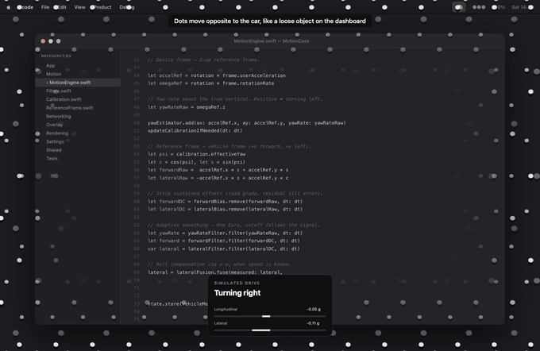

# MotionCues

[](https://github.com/mcpeixoto/MotionCues/actions/workflows/ci.yml)
[](LICENSE)


Vehicle Motion Cues for the Mac. Small dots along the edges of the screen move
with the car's real acceleration, so what your eyes see matches what your inner
ear feels.

Menu-bar app, no Dock icon, click-through overlay, no network access beyond a
direct link to your own iPhone.



> The clip above is **not a screen recording** — Screen Recording permission was
> not available on the machine this was built on. Every dot position in it is
> nonetheless the genuine output of the shipping `MotionEngine` and
> `LayerDotRenderer`, rendered offline frame by frame; only the desktop behind
> the dots is a mockup. Intensity is set to High so the movement survives video
> compression. The state panel is driven by the same `VehicleMotion` the
> particles are, so it cannot disagree with them. See
> [Tools/README.md](Tools/README.md) for exactly how it is generated, and
> regenerate it yourself in three commands.

> **Status:** works, and every claim in this README was measured rather than
> assumed. It is a personal project: there are no signed or notarised builds,
> so you build it from source. No Internet access, no telemetry, no
> dependencies — see [PRIVACY.md](PRIVACY.md) and [SECURITY.md](SECURITY.md).

---

## Phase 1 — What sensors a Mac actually has

Everything below was checked against the macOS 26.5 SDK on this machine
(MacBook Air, `Mac16,12`, Apple M4), not from memory.

### Core Motion on macOS

```
$ grep -B1 "@interface CMMotionManager"        CoreMotion.framework/Headers/CMMotionManager.h
COREMOTION_EXPORT API_AVAILABLE(ios(4.0)) API_UNAVAILABLE(macos)
@interface CMMotionManager : NSObject

$ grep -B1 "@interface CMHeadphoneMotionManager" .../CMHeadphoneMotionManager.h
COREMOTION_EXPORT API_AVAILABLE(macos(14.0), ios(14.0), watchos(7.0)) API_UNAVAILABLE(visionos)
@interface CMHeadphoneMotionManager : NSObject

$ grep -B1 "@interface CMBatchedSensorManager" .../CMBatchedSensorManager.h
COREMOTION_EXPORT API_AVAILABLE(watchos(10.0)) API_UNAVAILABLE(macos)
```

| API | macOS | Verdict |
|---|---|---|
| `CMMotionManager` (accelerometer, gyroscope, device motion) | `API_UNAVAILABLE(macos)` | **Not available. At all.** |
| `CMHeadphoneMotionManager` | `macos(14.0)` | Available — head motion from AirPods |
| `CMBatchedSensorManager` | watchOS only | Not available |
| `CMHeadphoneActivityManager` | `macos(15.0)` | Activity classification, not motion data |

### Is there any inertial hardware at all?

No. The IORegistry on this M4 machine has no motion sensor node:

```
SMCMotionSensor      -> 0 matches
AppleSMCMotionSensor -> 0 matches
IOAccelerometer      -> 0 matches
AppleAccelerometer   -> 0 matches
AppleGyro            -> 0 matches
```

The old Sudden Motion Sensor existed to park hard-drive heads and disappeared
with spinning disks. Apple Silicon Macs ship no IMU. The only motion-adjacent
HID node is the lid-angle sensor (`AppleDeviceManagementHIDEventService`,
vendor-defined usage page `0xFF00`), which reports how far the screen is open
and nothing else.

### What was considered and rejected

* **Core Location on the Mac** — `CLLocationManager` exists, but a Mac has no
  GPS receiver. Position comes from Wi-Fi database lookups: tens of metres of
  error, updates every several seconds, and `speed` / `course` are typically
  unusable. Fine for "which city", useless at 100 Hz.
* **Camera optical flow** (`VNGenerateOpticalFlowRequest`) — needs camera
  permission, burns power, points at the passenger's face rather than the
  road, and estimates *apparent* motion, not acceleration.
* **Apple Watch** — has a good IMU, but wrist motion is even noisier than head
  motion, and getting a watchOS app to talk directly to a Mac without the
  phone in the middle is awkward.
* **Faking it from time alone** — explicitly ruled out. The whole therapeutic
  point is that the cue matches the vestibular signal; an animation that does
  not would make motion sickness *worse*, not better.

### Conclusion

A two-tier architecture, both tiers real:

1. **iPhone companion — the accurate path.** `CMDeviceMotion` at 100 Hz,
   streamed over the local network. This is the recommended source.
2. **AirPods — the degraded fallback.** `CMHeadphoneMotionManager` gives
   genuine inertial data at a fixed ~25 Hz, but head movement is superimposed
   on it. Usable when the phone is not to hand; clearly labelled as degraded,
   filtered harder, and gated so a head turn does not read as a corner.
3. **Simulator — for development.** A synthetic drive that produces real
   device-frame samples with a deliberately misaligned sensor, so the entire
   pipeline including calibration can be exercised at a desk.

---

## Architecture

```
┌─────────── iPhone ───────────┐        ┌──────────────── Mac ─────────────────┐
│ CMMotionManager 100 Hz       │        │ MotionReceiver (NWListener, UDP)     │
│   .xArbitraryZVertical       │        │        ↓                             │
│ CLLocation speed (optional)  │  UDP   │ MotionEngine                         │
│        ↓                     │ ─────▶ │   ReferenceFrameResolver             │
│ MotionFrameCodec (76 bytes)  │ 7.6kB/s│   YawEstimator  (calibration)        │
│        ↓                     │ ◀───── │   BiasTracker → OneEuro → fusion     │
│ LinkCore (NWBrowser+NWConn)  │  1 Hz  │        ↓                             │
└──────────────────────────────┘  ack   │ MotionStateBox  (lock, latest wins)  │
                                        │        ↓  read at vsync              │
                                        │ OverlayView ×N screens (CADisplayLink)│
                                        │   LayerDotRenderer (CALayer per dot) │
                                        └───────────────────────────────────────┘
```

`MotionProvider` is the seam: `MotionReceiver`, `HeadphoneMotionProvider` and
`SimulatedMotionProvider` are interchangeable, and `Automatic` runs the phone
listener permanently with AirPods covering the gaps.

### How latency is kept down

| Stage | Cost |
|---|---|
| Core Motion sampling | 10 ms (100 Hz) |
| Encode 76 bytes, fixed layout | negligible |
| UDP over AWDL / local Wi-Fi | ~3–15 ms typical |
| Filter chain (all IIR, no buffering) | < 0.05 ms |
| Wait for the next vsync | 0–16.7 ms (0–8.3 on ProMotion) |

Decisions that matter:

* **UDP, not TCP.** A lost datagram costs 10 ms of staleness. A TCP
  retransmit would stall every *later* sample behind it and produce a visible
  hitch. Sequence numbers detect loss; stale reordered packets are dropped.
* **No jitter buffer.** Latest sample wins. Smoothing happens in the filter,
  not in a queue.
* **Zero actor hops on the hot path.** The Core Motion callback writes
  straight into the network queue on the phone; on the Mac the sensor queue
  writes into a lock-protected struct that the display link reads. SwiftUI is
  never invalidated by sensor data — it only drives the menu and the settings
  window.
* **`includePeerToPeer = true`.** Discovery and data run over AWDL when no
  Wi-Fi network is present, so this works in a car with no infrastructure at
  all. Wi-Fi must be switched on, but need not be joined to anything.

### Filtering, and why

`CMDeviceMotion` is already the output of Apple's sensor fusion: gravity and
user acceleration arrive pre-separated with a drift-corrected attitude.
Re-fusing raw accelerometer and gyroscope with a complementary or Kalman filter
on top of that would be strictly worse *and* slower, so we don't.

What we add:

* **One Euro filter** on each vehicle axis. A fixed low-pass forces one global
  compromise: quiet at rest *or* responsive under braking, never both. One
  Euro adapts its cutoff to the signal's own rate of change. Parameters came
  from a sweep against three criteria simultaneously — residual noise on a
  parked car, time to 90 % of a 0.3 g braking step, and amplitude retention on
  a 0.25 Hz manoeuvre. The chosen defaults (`minCutoff` 0.3 Hz, `beta` 3.0,
  `derivativeCutoff` 0.6 Hz) give < 0.004 g of rest jitter, ~130 ms to 90 % of
  a step, and 98 % amplitude retention.
* **A slow bias tracker** (τ = 45 s, further slowed while the signal is large)
  to remove road grade and residual calibration tilt without eating a real
  six-second acceleration.
* **A complementary fusion on the lateral axis only**, when the phone supplies
  GPS speed. Measured lateral acceleration is polluted by body roll — the car
  leans into a corner and gravity bleeds into the horizontal plane. The
  kinematic estimate `v·ω` has no such error but needs speed. Crossing them
  over at 0.25 Hz takes the low frequencies from `v·ω` (where roll error is
  worst) and the high frequencies from the accelerometer (where GPS is too
  slow). This is the one place a complementary filter genuinely earns its
  place.
* **A critically damped spring** on the render side, integrated analytically
  so it is stable at any frame interval. It keeps motion continuous across a
  dropped packet and behaves identically at 60 Hz and 120 Hz.

### Calibration

Two unknowns, handled separately.

**Tilt** is free: `.xArbitraryZVertical` already pins Z to true vertical from
the accelerometer, so however the phone is lying, roll and pitch are solved.
(Note we deliberately do *not* use `.xMagneticNorthZVertical` — inside a steel
car body with speakers and a charging cable, the magnetometer is noise.)

**Heading** — which way the car points relative to the sensor's arbitrary X
axis — is learned from the driving itself, by regressing horizontal
acceleration onto yaw rate:

```
cov(a_horizontal, ω_z) ≈ (v̄ / g) · left̂
```

because lateral acceleration is `v·ω` and a car's speed is always positive.
Normalising that covariance vector gives the left axis *including its sign*, so
there is no forwards/backwards ambiguity to resolve afterwards. Forward is that
rotated by −90°.

An earlier version used PCA on the acceleration cloud, assuming braking
dominates the variance. That is wrong often enough to matter: a few roundabouts
put more energy into the lateral axis and the estimate locks on 90° out. PCA
survives only as the fallback for a motorway stretch with no cornering at all,
where it is reported at capped confidence and never marked usable — because
without a turn, forwards versus backwards genuinely cannot be determined, and
guessing would invert every cue.

The same estimator keeps running slowly in the background, which absorbs the
few-degrees-per-minute gyro heading drift and copes with the phone being nudged.

### Visual mapping

The field follows the pseudo-force `f = −a`: it moves the way a loose object in
the cabin moves, which is what your vestibular system is reporting.

| Car does | Field does |
|---|---|
| accelerates | expands outwards from the centre |
| brakes | contracts inwards |
| turns left | slides right |
| turns right | slides left |
| crests a rise | drifts down |

Three things about that table are worth explaining, because two earlier
versions of this got them wrong.

**It is velocity, not displacement.** The first version offset dots in
proportion to instantaneous acceleration. A firm brake is 0.3 g, which came to
about twenty points of travel that then sprang back — invisible in peripheral
vision, which is exactly where the cue lives. What the visual system responds
to is optic flow, so acceleration now drives the field's *speed*. Standing
still means no acceleration, therefore no flow, therefore a completely static
field — that part is a hard requirement and there is a test for it.

**It is radial, not vertical.** The second version streamed dots up and down
the screen edges. But forward motion does not look like things sliding
downwards; it looks like the world expanding past you, away from the point you
are heading for. That is the actual optic-flow signature of translation. So the
field has depth, the particles are projected through a pinhole, and
accelerating pushes the whole field towards the viewer: particles spread out
from the centre and grow, braking pulls them back in.

**The grid wraps in all three axes**, so there is no edge to run out of. The
second version had to bound sideways travel because dots ran off the screen
during a sustained corner, and that asymmetry was a symptom of the model being
wrong rather than of the screen being small. It is simply gone now.

Two other details:

* **Every particle is drawn twice**, once light and once dark, slightly offset.
  The overlay is not allowed to see what is behind it without Screen Recording
  permission, so rather than guess the background, one of each pair is
  guaranteed to contrast with it.
* **The cue stays in your peripheral vision.** Particle opacity falls off with
  distance from the screen edge, so the middle — where you are actually
  reading — stays clear.

The idea of a wrapping 3-D particle grid with perspective, motion trails and
paired light/dark dots came from reading
[EasyQueasy](https://github.com/Kalabasa/EasyQueasy) (Android, GPL-3.0). It is
reimplemented here from the idea, not the code; MotionCues is MIT and contains
no GPL material. [MacMotionCues](https://github.com/Lospi/MacMotionCues) is the
other prior art worth knowing about on this platform.

### Rendering

One instanced Metal draw call for the whole field. Each particle is a quad
stretched along its own motion, and the fragment shader measures distance to a
line segment — a capsule, which degenerates to a circle when the particle is
still. That gives the dot and its motion trail from a single primitive.

The shader is compiled from source at launch rather than at build time, so the
project needs no Metal Toolchain component. That matters: it is a large
separate download that a fresh Xcode install and a CI runner do not have.

The earlier CALayer-per-dot renderer was right for sixteen dots and wrong for a
field of several hundred with trails and paired colours.

---

## Overlay: what works and what cannot

`NSPanel` with `[.borderless, .nonactivatingPanel]`, `level = .screenSaver`,
`collectionBehavior = [.canJoinAllSpaces, .stationary, .fullScreenAuxiliary,
.ignoresCycle]`, `ignoresMouseEvents = true`, one window per `NSScreen`,
rebuilt on `didChangeScreenParameters`.

Handled: multiple monitors, mixed Retina scale factors, resolution changes,
displays plugged and unplugged, Spaces, wake from sleep, ProMotion (each
overlay ticks on its own screen's `CADisplayLink`). Verified with two displays
attached: one `OverlayWindow` per screen, each matching its own frame including
a secondary display at a negative origin.

Requires **no** permissions — no Accessibility, no Screen Recording.

Honest limitations, stated rather than papered over:

* **Native full-screen apps.** `.fullScreenAuxiliary` at `.screenSaver` level
  works for the large majority (Safari, VS Code, video in a browser). It is
  not a guarantee. An app that takes an exclusive display — a game using a
  captured display, Keynote presenter mode — will cover it, and no public API
  changes that.
* **Login window, screen saver, secure input, Fast User Switching** hide all
  application windows, including this one. Correct behaviour.
* **Dot colour cannot follow the actual background.** Reading the pixels
  behind the overlay would need Screen Recording permission. Colour follows the
  system appearance instead, and every dot carries a contrasting halo so it
  stays legible either way. There is also a manual light/dark override.
* **Screen sharing.** The overlay appears in recordings by default. There is a
  setting that sets `sharingType = .none` to exclude it.

---

## Privacy

No accounts, no cloud, no analytics, no telemetry, no Internet access of any
kind. The app's sandbox has `network.server` and `network.client` purely for
the direct link to your own phone. Sensor data is processed in memory and never
written to disk; the only thing persisted is your settings and the calibration
angle.

---

## Building

Requires Xcode 16 or later (developed against Xcode 26.6), macOS 14+, iOS 17+.

The `.xcodeproj` is generated from `project.yml` and deliberately not
committed, so a fresh clone needs one extra step:

```bash
brew install xcodegen
git clone https://github.com/mcpeixoto/MotionCues.git
cd MotionCues
xcodegen generate
open MotionCues.xcodeproj
```

Two schemes: `MotionCues` (macOS) and `MotionCuesIOS`.

```bash
# macOS app + tests
xcodebuild -project MotionCues.xcodeproj -scheme MotionCues \
           -destination 'platform=macOS' test

# iOS companion
xcodebuild -project MotionCues.xcodeproj -scheme MotionCuesIOS \
           -sdk iphonesimulator build
```

To run the iPhone app on a real device you will need to set your own team and
bundle identifier in the `MotionCuesIOS` target — the local link needs a real
phone, so the Simulator is only good for checking the UI.

## Trying it without a car

1. Launch the Mac app. A car icon appears in the menu bar.
2. **Sensor → Simulator**, then **Start**.
3. Dots appear along both edges and run a 60-second scripted drive: pulling
   away, cruising, a long left bend, braking, a roundabout, hard acceleration,
   S-bends, slowing to a stop.
4. **Settings → Motion → Live reading** shows the three filtered channels in g.
5. **Settings → Calibration → Calibrate** works against the simulator too; the
   synthetic sensor is deliberately misaligned, so you can watch the estimator
   find the forward axis.

## Using it for real

1. Install the companion on your iPhone, open it, tap **Start streaming**.
   Grant Motion and Local Network when asked.
2. On the Mac choose **Sensor → Automatic** and press **Start**. The Mac
   advertises `_mcues._udp`; the phone finds it, usually within a second.
3. Put the phone wherever it will stay put. Orientation does not matter — only
   that it does not slide around.
4. **Settings → Calibration → Calibrate**, then travel normally for about
   twenty seconds including at least one bend.
5. Adjust **Intensity** to taste. Start at Low.

**Settings → Sensors** has *Open MotionCues at login* (via `SMAppService`,
the supported sandbox-friendly API), *Start cues automatically when the app
launches*, and *Only show cues while the car is moving*. Together those mean
you get in the car, open the lid, and it is already running — and it puts
itself away when you park.

That last one is done on the phone, not the Mac. The obvious way to detect
driving is Core Location, and the obvious device is the one showing the
overlay — but a Mac has no GPS, so its position comes from Wi-Fi lookups with
tens of metres of error, which cannot tell a car from a chair. The phone has
`CMMotionActivityManager`, whose `automotive` classification answers exactly
this question on a coprocessor for almost no battery. It is combined with GPS
speed and a 90-second hysteresis, because a red light is not the end of a
journey. The verdict rides along in the motion packets that are already
flowing.

It is off by default on the phone, and the Mac only ever acts on a definite
"not driving": if nothing is reporting a drive state, the cues stay up.
Silently hiding the overlay because we do not know would be much worse than
showing it when it is not needed.

On first launch a short welcome window explains the setup, because a menu-bar
app with no Dock icon otherwise appears to do nothing at all.

In a car with no Wi-Fi network: leave Wi-Fi switched **on** anyway on both
devices. Peer-to-peer discovery uses the Wi-Fi radio and does not need a
network to join. Personal Hotspot with the Mac joined also works.

## Measured cost

On an M4 MacBook Air at 1470×956, Release build:

| Condition | CPU |
|---|---|
| Simulator source, 100 Hz sensor, full particle field | ~3–6 % of one core |
| The same across two displays (1920×1080 + 1470×956) | ~4–7 % |
| Idle (no motion for 3 s — display links park themselves) | ~1–2 % |

Getting there took measuring rather than guessing. A full-screen Metal overlay
at native Retina resolution cost 9–18 %. Dropping the render resolution to
1.25× brought it to 5–10 %; dropping it further to 1.0× did *not* help, which
showed the cost was per-frame compositing rather than pixels. Varying the
frame rate with how much is actually happening — 24 fps cruising, 60 under a
hard brake — is what brought it down to 3–6 %.


Memory ~76 MB resident. Network traffic 7.6 kB/s while streaming.

## Tests

`xcodebuild ... test` runs 43 tests covering the parts that fail silently if
they are wrong:

* wire format round-trips, and rejection of foreign, truncated and
  wrong-kind data;
* attitude-convention resolution, including the AirPods case where neither
  convention fits and it must fall back to gravity-only;
* every filter against a numeric target rather than "looks smooth";
* calibration recovery across four driving regimes — normal, cornering-
  dominated town driving, the 180° forwards/backwards case, and a motorway
  stretch with no bends where it must report low confidence instead of
  guessing;
* an end-to-end run of the engine against ground truth with an unknown phone
  orientation and an unknown car heading, checked by correlation and by
  axis cross-talk;
* the particle field: silence at rest, radial expansion under acceleration and
  contraction under braking, lateral slide in corners, a seamless wrap, bounded
  particle counts on a 6K display, and that the cue stays in the periphery;
* that the Metal shader actually compiles — it is built from source at launch,
  so a syntax error would otherwise surface only as a silently missing overlay;
* the real `MotionReceiver` over a real UDP socket on loopback: delivery,
  stale-packet rejection, garbage rejection, and the heartbeat.

Bonjour discovery is deliberately outside the automated tests — advertising a
service triggers the Local Network permission prompt on recent macOS, which
would make the result depend on someone clicking a dialog.

### Verifying the UI parts

Some things cannot be asserted from a unit test. The app has an env-gated
self-check for those:

```bash
MC_PROBE=1 /path/to/MotionCues.app/Contents/MacOS/MotionCues
# PROBE launch (2): [NSStatusBarWindow level=25 visible=true frame=(855, 923, 37, 33),
#                    OverlayWindow level=1000 visible=true frame=(0, 0, 1470, 956)]
# PROBE after-open-settings (3): [..., AppKitWindow level=0 visible=true]
```

which confirms the status item exists, the overlay covers the whole screen at
screen-saver level, no stray window opens at launch, and the settings window
opens on request.

Note that `CGWindowListCopyWindowInfo` from another process is *not* a reliable
way to check either of these: it does not report SwiftUI `MenuBarExtra` status
items at all, and its reported bounds for the overlay disagree with the
window's own frame. Ask the app, not the WindowServer.

## Contributing

See [CONTRIBUTING.md](CONTRIBUTING.md). Short version: `project.yml` is the
source of truth, tests must stay green, and a change to the filters or the
motion maths needs a number attached to it rather than "feels smoother".

## Layout

```
MotionCues/
├── Shared/              wire format, VehicleMotion  (both targets)
├── MotionCues/
│   ├── App/             menu bar, coordinator, source selection policy
│   ├── Motion/          MotionProvider + implementations, engine, filters,
│   │                    reference frame, calibration
│   ├── Networking/      MotionReceiver (NWListener)
│   ├── Overlay/         window, view, multi-screen controller
│   ├── Rendering/       dot layout and CALayer renderer
│   └── Settings/        settings model and windows
├── MotionCuesIOS/
│   ├── Motion/          CMDeviceMotion + optional GPS speed
│   ├── Networking/      MotionSender / LinkCore
│   └── UI/
└── Tests/
```
